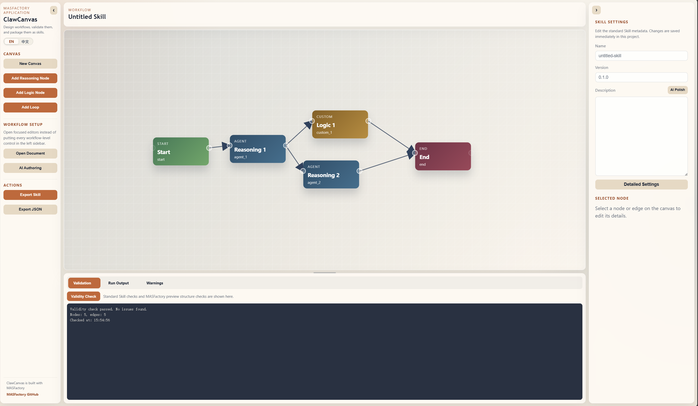

# ClawCanvas

This directory contains the MASFactory-based **ClawCanvas** visual skill studio. It lets users design agent workflows on a web canvas, validate the graph, run supported nodes through MASFactory, and export the workflow with skill metadata as a reusable skill package.

## Experience

- Hosted experience: https://clawcanvas.masfactory.dev

## Overview

**ClawCanvas** is a visual builder for MASFactory workflows and skill packages. It is designed for users who want to move from an idea to a runnable, reusable agent workflow without hand-writing every graph definition first. The app combines a draggable workflow canvas, structured node inspectors, runtime validation, test execution, and export tools.

The current implementation focuses on practical skill-authoring workflows:

- build a workflow on a web canvas
- validate structure before execution
- execute supported nodes through MASFactory with a user-supplied API key
- export workflow JSON or a publishable skill package
- use AI-assisted field authoring for selected node and skill metadata

## Workflow Design

ClawCanvas maps canvas nodes into MASFactory graph components. The backend validates the canvas schema, compiles supported node types into runtime objects, binds supported tools, and packages the result with metadata for reuse.

Currently supported runtime node types:

- `start`
- `agent`
- `custom`
- `loop`
- `end`

Current runtime constraints:

- graph must be a DAG
- exactly one `start` and one `end`
- `custom` nodes support built-in transform modes: `passthrough`, `template`, `set`, `pick`
- `loop` nodes compile into subgraph-based MASFactory `Loop` nodes with explicit controller inputs and outputs
- supported tool execution is runtime-bound for `builtin` tools and configured `api` tools
- `mcp` entries still need an external connector layer
- knowledge and behavior rules are compiled into agent prompt context, not yet into dedicated retrievers or MCP-backed tools

## Product Preview

The interface presents a node canvas in the center, reusable workflow controls around it, and node-specific inspectors for configuring prompts, tools, schemas, loop behavior, and export metadata.

<p align="center">
  
</p>

## Layout

```text
applications/clawcanvas/
├── assets/
│   ├── clawcanvas-preview-en.png
│   └── clawcanvas-preview-zh.png
├── backend/
│   ├── clawcanvas_backend/
│   │   ├── app.py                   # Flask API and static frontend serving
│   │   ├── ai_authoring.py          # AI-assisted field authoring
│   │   ├── compiler.py              # Canvas graph to MASFactory runtime compiler
│   │   ├── key_pool.py              # Runtime API key handling
│   │   ├── runtime_bindings.py      # Built-in and API tool bindings
│   │   ├── schema.py                # Request / graph schema helpers
│   │   ├── skill_packager.py        # Skill package exporter
│   │   └── validation.py            # Graph validation helpers
│   ├── requirements.txt
│   └── tests/
├── frontend/
│   ├── index.html
│   ├── package.json
│   ├── vite.config.js
│   └── src/
│       ├── App.vue
│       ├── components/
│       └── composables/
├── deploy_15081.sh
├── pyproject.toml
└── README.md
```

## Setup

Run MASFactory dependency installation from the repo root:

```bash
uv sync
```

Install app-specific backend dependencies:

```bash
cd applications/clawcanvas
python -m pip install -e .
python -m pip install -r backend/requirements.txt
```

Install frontend dependencies:

```bash
cd applications/clawcanvas/frontend
npm ci
```

Environment requirements:

- Python `>= 3.10`
- Node.js `>= 18`
- an OpenAI-compatible API key when running agent nodes or AI authoring

Useful environment variables:

```bash
export CLAWCANVAS_HOST="0.0.0.0"
export CLAWCANVAS_PORT="15081"
export OPENAI_API_KEY="..."
export BASE_URL="https://api.openai.com/v1"
export MODEL_NAME="gpt-5.2"
```

## Run

Commands below assume the working directory is `applications/clawcanvas/`.

Run the backend after building the frontend:

```bash
cd frontend
npm run build

cd ../backend
python -m clawcanvas_backend.app
```

By default the backend serves the built frontend and API on `0.0.0.0:15081`. Override with `CLAWCANVAS_HOST` and `CLAWCANVAS_PORT` if needed.

For frontend-only development:

```bash
cd frontend
npm run dev
```

In production, the built frontend calls the API through same-origin `/api`.

## Deploy

From the repository root:

```bash
applications/clawcanvas/deploy_15081.sh
```

The script installs backend dependencies, builds the frontend, and starts gunicorn on `0.0.0.0:15081` by default. Open `http://127.0.0.1:15081/` locally, or expose port `15081` from the host.

Override host or port:

```bash
CLAWCANVAS_HOST=127.0.0.1 CLAWCANVAS_PORT=15081 applications/clawcanvas/deploy_15081.sh
```

## API Surface

The backend exposes:

- `GET /api/health`
- `GET /api/demo`
- `POST /api/validate`
- `POST /api/run`
- `POST /api/export-skill`
- `POST /api/export-json`
- `GET /api/download-export`
- `POST /api/validate-skill`
- `POST /api/ai-authoring/field`

## Outputs

Export actions create downloadable artifacts under `applications/clawcanvas/exports/`, including workflow JSON and skill package archives.

The exported skill package is intended to contain:

- workflow definition
- skill metadata
- behavior / knowledge configuration
- runtime-ready files required by the selected export mode

## Notes

- The app is an MVP skill-authoring studio rather than a full no-code runtime for every MASFactory feature.
- Tool support is intentionally conservative. Built-in and configured API tools are supported; MCP connector execution still needs external wiring.
- Runtime execution depends on the API key and model configuration supplied by the user or environment.
